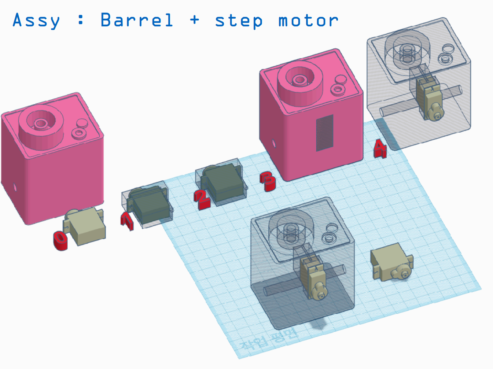

## Hello! This is a page as a collection of my major projects.
### V.C.

### You'll find all of my open source contributions and recent projects at my [school GitHub account.](https://github.com/zielo-hue)
Some highlights:
* [A collaborative, open source project](https://github.com/hitomi-team/sukima) to make large language models and its full set of features available to end users who can't run such models due to consumer hardware constraints.
* [A chatbot](https://github.com/zielo-hue/JazzMock) leveraging GPT-2 for conversational tasks.
* [Novation Launchpad MIDI controller software](https://github.com/zielo-hue/macro-launchpad) which uses a MIDI controller as a user interface for triggering scripts.
There are quite a few more than the list above on the GitHub account page.

## Maker Projects
### Sentry Gun from Team Fortress 2
The following sequence of images details my process for this project from concept, to design, to production.

* My initial sketch of what I wanted to build.

* Using TinkerCAD and Fusion360 to model spaces for electronics and mechanical joints

* In construction... A power supply is visible in the head component.

### The Sentry Gun in action.
The Sentry Gun uses a mounted camera (visible on the center piece) and OpenCV for facial recognition. It uses a rotational servo for head movement and an Arduino microcontroller to control the electronics. While the finished product lacks vertical head movement and onboard processing (largely due to processing limitations of maker-oriented SBCs at the time) from the original concept, it is still a Sentry Gun and accomplishes the core goals I had since the beginning: taking aim at human faces and blasting yellow photons towards its target.
